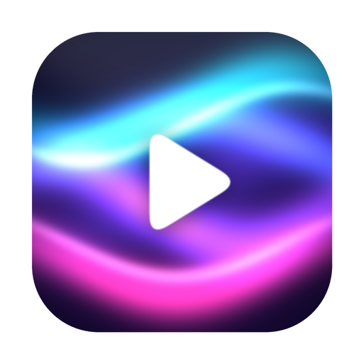
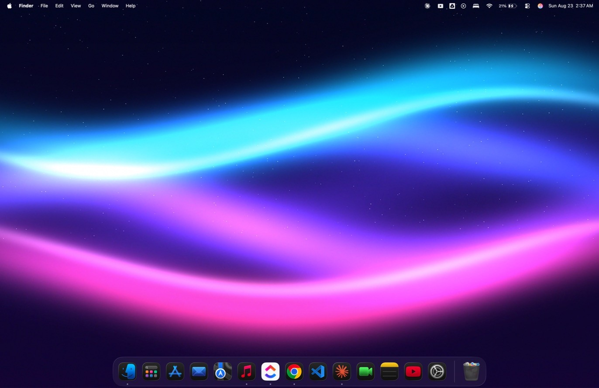
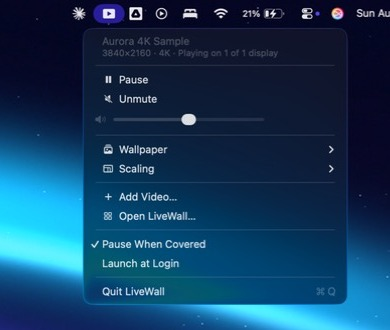
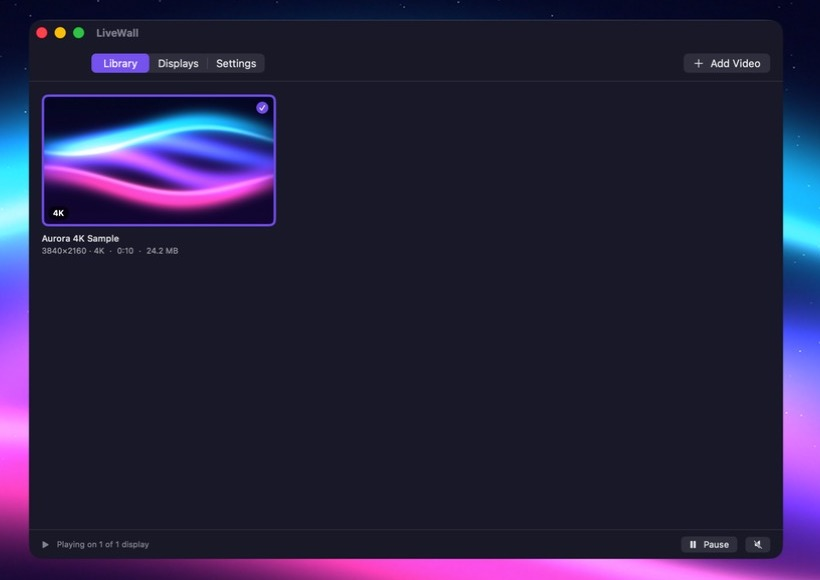

<div align="center">



# LiveWall

**Live video wallpapers for macOS. Native, 4K, and light on your battery.**

[](https://github.com/roshworldwide/livewall/actions/workflows/build.yml)
[](https://github.com/roshworldwide/livewall/releases/latest)
[](https://github.com/roshworldwide/livewall/releases)
[](https://github.com/roshworldwide/livewall/releases/latest)
[](https://swift.org)
[](LICENSE)

[**Download**](https://github.com/roshworldwide/livewall/releases/latest) · [Features](#features) · [How it works](#how-it-works) · [Build from source](#build-from-source) · [Contributing](CONTRIBUTING.md)



</div>

---

Play any video as your desktop wallpaper. Drop in a file, pick it, done — it
sits behind your icons and windows and loops without a seam.

No Electron, no browser engine, no helper daemon. About 2,500 lines of Swift
against AppKit and AVFoundation, in a 4 MB app bundle. Video decoding runs on
your Mac's dedicated media engine, so a 4K wallpaper costs a few percent CPU
instead of a fan.

## Install

### Download

Grab the latest DMG from **[Releases](https://github.com/roshworldwide/livewall/releases/latest)**,
open it, and drag LiveWall into Applications.

### First launch

**Right-click LiveWall → Open**, then click *Open* in the dialog. You only do
this once.

LiveWall is ad-hoc signed rather than notarized — notarization requires a paid
Apple Developer account, and this is a free project. Gatekeeper therefore blocks
a plain double-click the first time with *"cannot be opened because the developer
cannot be verified."* Right-click → Open gives you the override. If you'd rather
use the terminal:

```bash
xattr -dr com.apple.quarantine /Applications/LiveWall.app
```

You can verify what you downloaded against the SHA-256 published on every release:

```bash
shasum -a 256 ~/Downloads/LiveWall-1.0.dmg
```

### Try it immediately

Every release ships an **`Aurora 4K Sample.mp4`** — a genuine 3840×2160 clip that
loops seamlessly. Drop it on the Library window and you're running.

## Features

|  | |
|---|---|
| **Any video, any resolution** | 1080p through 8K. H.264, HEVC and ProRes in `.mp4`, `.m4v` or `.mov`. |
| **Seamless looping** | `AVPlayerLooper` pre-enqueues the next pass, so there's no black flash at the loop point. |
| **Per-display wallpapers** | Different video on each monitor, or mirror one across all of them. Handles hot-plug. |
| **Menu bar control** | Play/pause, mute, volume, wallpaper picker and scaling without opening a window. |
| **Drag and drop** | Drop files anywhere on the Library window. Metadata and poster frames are generated automatically. |
| **Pauses when hidden** | Decoding stops entirely when windows cover the desktop, and on sleep. |
| **Doesn't duplicate your files** | References videos where they already live via security-scoped bookmarks. A 4 GB file stays one 4 GB file. |
| **Scaling modes** | Fill, Fit (letterbox), or Stretch. |
| **Launch at login** | Via `SMAppService`. |
| **Runs in the background** | Menu bar agent — no Dock icon unless the window is open. |

<div align="center">

&nbsp;&nbsp;&nbsp;

</div>

## Supported video

| | |
|---|---|
| **Containers** | `.mp4`, `.m4v`, `.mov` |
| **Codecs** | H.264, HEVC (H.265), ProRes |
| **Resolution** | Anything — 1080p, 1440p, 4K, 5K, 8K |
| **HDR** | Plays, tone-mapped by the system |

**Not supported:** `.webm`, `.mkv`, `.avi`, VP9, AV1. macOS has no native decoder
for these, and shipping one would mean bundling FFmpeg and giving up hardware
decoding — the whole reason this app is cheap to run. Convert first:

```bash
# Best quality per byte — HEVC via the hardware encoder, audio stripped
ffmpeg -i input.webm -c:v hevc_videotoolbox -b:v 12M -tag:v hvc1 -an output.mp4

# Wider compatibility — H.264
ffmpeg -i input.mkv -c:v h264_videotoolbox -b:v 16M -an output.mp4
```

## How it works

The whole trick is window layering. LiveWall creates one borderless `NSWindow`
per display at:

```swift
NSWindow.Level(rawValue: Int(CGWindowLevelForKey(.desktopIconWindow)) - 1)
```

One level *below* desktop icons and *above* the static desktop picture. With
`ignoresMouseEvents = true`, clicks fall straight through to the Finder desktop,
and `[.canJoinAllSpaces, .stationary]` keeps the wallpaper on every Space without
following you into another app's full-screen window.

Each window hosts an `AVPlayerLayer` fed by an `AVQueuePlayer` + `AVPlayerLooper`.
The looper is the part that matters: it pre-enqueues copies of the item so the
loop point has no gap. Seeking on `AVPlayerItemDidPlayToEndTime` — the obvious
approach — produces a visible black flash on every loop.

There's **one player per display**, because `AVPlayerLayer` can only be bound to
one `AVPlayer` at a time. Mirroring loads the asset twice on purpose; sharing a
player makes the second display go black.

### One-directional state

```
UI  ──writes──▶  Preferences  ──notifies──▶  WallpaperEngine  ──▶  one output per display
```

Views never call the engine. They write to `Preferences`, which posts
`.liveWallPreferencesChanged`, and the engine reconciles every display against
that state. Multi-display state can't drift, because there's only one place it
lives.

### Battery

`updatePlayback(for:)` is the single gate on whether any display decodes a frame.
It watches `NSWindow.occlusionState`, so a full-screen browser stops playback
entirely rather than rendering into pixels nobody sees. Sleep and display-sleep
do the same, and windows are rebuilt on wake in case displays were re-enumerated.

### Project layout

```
LiveWall/
├── main.swift                     NSApplication bootstrap, agent activation policy
├── AppDelegate.swift              Lifecycle, main menu, window management
├── Engine/
│   ├── WallpaperWindow.swift      The desktop-level window
│   ├── WallpaperContentView.swift Layer-hosting AVPlayerLayer container
│   └── WallpaperEngine.swift      One output per display, playback gating
├── Model/
│   ├── WallpaperVideo.swift       Bookmark-backed video reference
│   ├── LibraryStore.swift         JSON persistence + import pipeline
│   └── ThumbnailGenerator.swift   Poster frames + metadata probing
├── Support/
│   ├── LibraryPaths.swift         ~/Library/Application Support/LiveWall/
│   ├── Preferences.swift          Single source of truth
│   └── LaunchAtLogin.swift        SMAppService wrapper
└── UI/                            Menu bar controller + SwiftUI window
```

## Build from source

**Requirements:** macOS 13 Ventura or newer, Xcode 16 or newer. No Apple
Developer account needed.

```bash
git clone https://github.com/roshworldwide/livewall.git
cd livewall
open LiveWall.xcodeproj      # then ⌘R
```

To produce a DMG the way CI does:

```bash
bash Scripts/build.sh
```

Or just **double-click `Build LiveWall.command`** in Finder — it preflights your
toolchain, compiles Release, ad-hoc signs, packages the DMG, verifies the
checksum and reveals it, writing everything to `build.log`.

Regenerate the demo wallpaper (needs `ffmpeg` and `numpy`):

```bash
python3 Scripts/make-sample-wallpaper.py
```

## Troubleshooting

<details>
<summary><b>"LiveWall is damaged and can't be opened"</b></summary>

Gatekeeper, not actual damage. See [First launch](#first-launch) —
right-click → Open, or `xattr -dr com.apple.quarantine /Applications/LiveWall.app`.
</details>

<details>
<summary><b>Nothing appears on the desktop</b></summary>

Check the menu bar item shows a wallpaper name and offers *Pause* rather than
*Play*. If a video is selected and nothing renders, the codec isn't supported —
see [Supported video](#supported-video).
</details>

<details>
<summary><b>The wallpaper covers my desktop icons</b></summary>

Shouldn't happen, but if a macOS update shifts the icon window level, change the
offset in `WallpaperWindow.wallpaperLevel` from `- 1` to `- 2`. Please open an
issue with your macOS version if you hit this.
</details>

<details>
<summary><b>"Launch at Login" won't turn on</b></summary>

The app isn't in `/Applications`. macOS refuses to register login items from
temporary locations. Move it and try again.
</details>

<details>
<summary><b>Second monitor is blank</b></summary>

Open **Displays** and confirm a video is assigned to it. If *Use the same
wallpaper on every display* is on, all monitors follow one choice.
</details>

<details>
<summary><b>How much battery does this actually cost?</b></summary>

A 4K HEVC wallpaper on Apple silicon typically sits in low single-digit CPU
percent, because the media engine does the decoding rather than the CPU. With
*Pause when the desktop is covered* on (the default), it drops to zero whenever
you're working full-screen. Higher bitrates and multiple displays cost more —
each display decodes its own stream.
</details>

## Roadmap

Contributions welcome on any of these — see [CONTRIBUTING.md](CONTRIBUTING.md).

- [ ] Pause on battery / Low Power Mode
- [ ] Playlists and shuffle
- [ ] Time-of-day switching (day/night wallpapers)
- [ ] Crossfade between wallpapers
- [ ] Global hotkeys
- [ ] Homebrew Cask
- [ ] Notarized builds

## License

MIT — see [LICENSE](LICENSE). Do what you like with it.

<div align="center">
<br>
<sub>Built with AppKit, SwiftUI and AVFoundation. No third-party dependencies.</sub>
</div>
